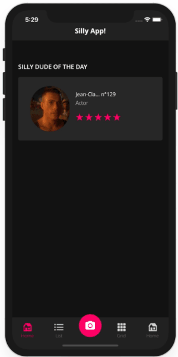
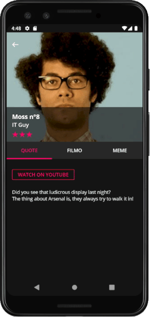
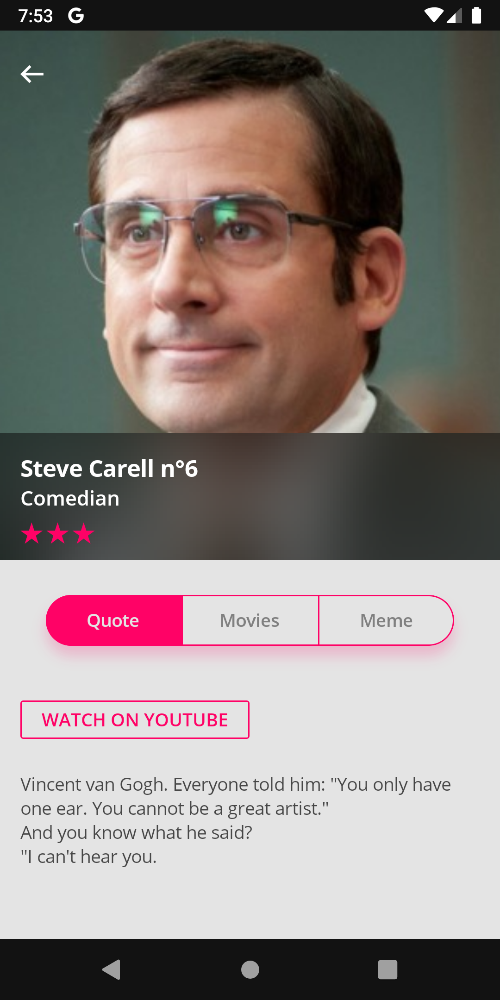
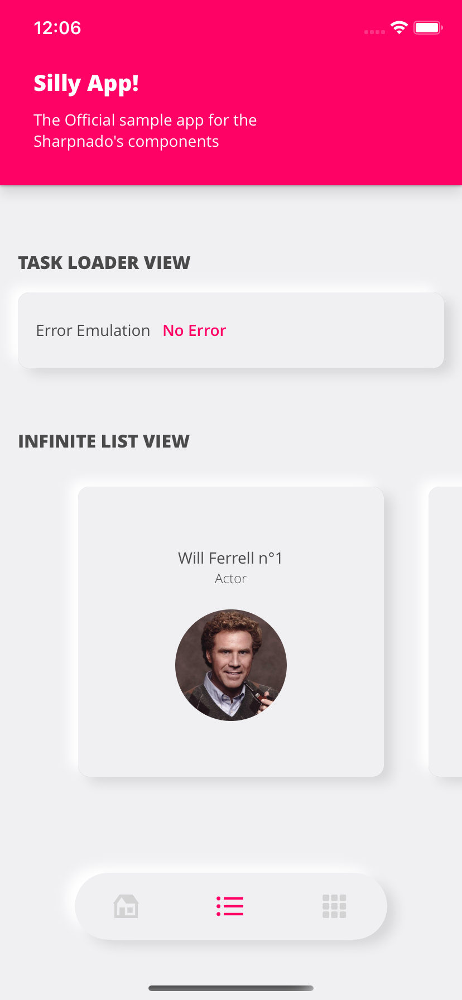
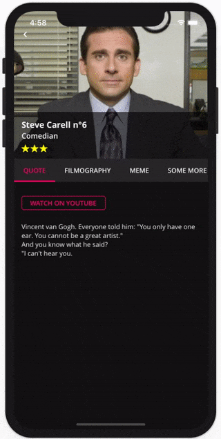
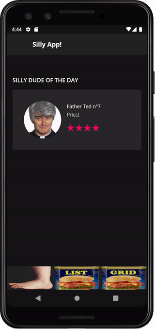
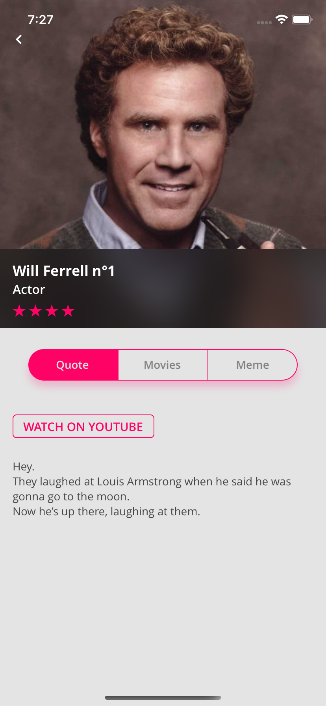
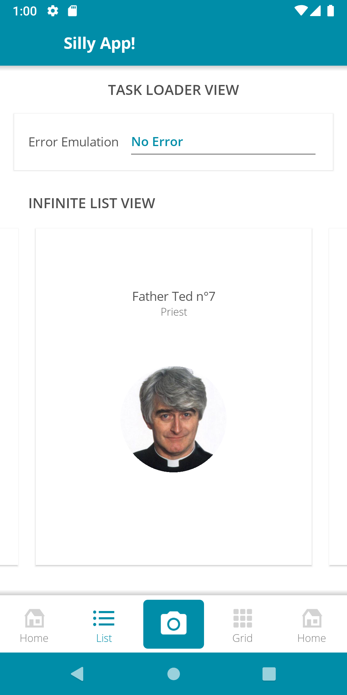

# Sharpnado.Tabs

<p align="left">

Get it from NuGet:

[](https://www.nuget.org/packages/Sharpnado.Tabs)

| Supported platforms        |
|----------------------------|
| :heavy_check_mark: Android |
| :heavy_check_mark: iOS     |
| :heavy_check_mark: UWP     |

* Fully customizable
* Stylable
* Component oriented architecture
* Layout your tabs and ```ViewSwitcher``` as you want
* Shadows included in `TabHost`

<table>
  <thead>
    <tr>
      <th>Bottom bar tabs</th>
      <th>Fixed tabs</th>
    </tr>
  </thead>
  <tbody>
    <tr>
      <td></td>
      <td></td>
    </tr>
    <tr>
      <td>BottomTabItem</td>
      <td>UnderlinedTabItem</td>
    </tr>   
  </tbody>
</table>

<table>
  <thead>
    <tr>      
      <th>Segmented tabs</th>
      <th>Neumorphic tabs</th>
    </tr>
  </thead>
  <tbody>
    <tr>
      <td></td>
      <td></td>
    </tr>
    <tr>
      <td>TabType.Scrollable</td>
      <td>inherit from TabItem</td>
    </tr>   
  </tbody>
</table>

<table>
  <thead>
    <tr>      
      <th>Scrollable tabs</th>
      <th>Custom tabs</th>
    </tr>
  </thead>
  <tbody>
    <tr>
      <td></td>
      <td></td>
    </tr>
    <tr>
      <td>TabType.Scrollable</td>
      <td>inherit from TabItem</td>
    </tr>   
  </tbody>
</table>

## Silly! app

The tabs components are presented in the Silly! app in the following repository:

https://github.com/roubachof/Xamarin-Forms-Practices

If you want to know how to use them, it's the best place to start.

## Installation

Because Tabs uses platform-specific effects like tinted images and tap feedback color, you must install the nuget package in all your targeted platforms projects (netstandard, ios, android, uwp).

Mandatory initializations on iOS:

    Xamarin.Forms.Forms.Init();
    Sharpnado.Tabs.Preserver.Preserve();

Mandatory initializations on UWP:

    var rendererAssemblies = new[] 
    { 
        typeof(UWPShadowsRenderer).GetTypeInfo().Assembly,
        typeof(UwpTintableImageEffect).GetTypeInfo().Assembly,
    };
    Xamarin.Forms.Forms.Init(e, rendererAssemblies);

## Shadows

The `TabHostView` inherits directly from `Shadows`. It means you can add as many shades as you like to your tab bar.
It behaves exactly the same as the `Shadows` component.

Since shadows are now handled by `Shades`, the old shadow renderers have been removed.
The `ShadowType` property is gone.

For more information about custom shades, visit the [Sharpnado.Shadows](https://github.com/roubachof/Sharpnado.Shadows) repo.


## UnderlinedTabItem with ViewSwitcher

Let's consider this view:

<p align="center">
  
</p>

And let's have a look at its code:

```xml
<Grid Padding="{StaticResource StandardThickness}"
      ColumnSpacing="0"
      RowSpacing="0">
    <Grid.RowDefinitions>
        <RowDefinition Height="200" />
        <RowDefinition Height="40" />
        <RowDefinition Height="30" />
        <RowDefinition Height="30" />
        <RowDefinition Height="50" />
        <RowDefinition Height="Auto" />
    </Grid.RowDefinitions>

    <!-- first 4 rows then... -->

    <tabs:TabHostView x:Name="TabHost"
                      Grid.Row="4"
                      Margin="-16,0"
                      BackgroundColor="#272727"
                      SelectedIndex="{Binding Source={x:Reference Switcher}, Path=SelectedIndex, Mode=TwoWay}">
        <tabs:TabHostView.Tabs>
            <tabs:UnderlinedTabItem Style="{StaticResource TabStyle}" Label="{loc:Translate Tabs_Quote}" />
            <tabs:UnderlinedTabItem Style="{StaticResource TabStyle}" Label="{loc:Translate Tabs_Filmography}" />
            <tabs:UnderlinedTabItem Style="{StaticResource TabStyle}" Label="{loc:Translate Tabs_Meme}" />
        </tabs:TabHostView.Tabs>
    </tabs:TabHostView>

    <ScrollView Grid.Row="5">
        <tabs:ViewSwitcher x:Name="Switcher"
                           Animate="True"
                           SelectedIndex="{Binding SelectedViewModelIndex, Mode=TwoWay}">
            <details:Quote Animate="True" BindingContext="{Binding Quote}" />
            <details:Filmo Animate="True" BindingContext="{Binding Filmo}" />
            <details:Meme Animate="True" BindingContext="{Binding Meme}" />
        </tabs:ViewSwitcher>
    </ScrollView>
</Grid>
```

The ```TabHostView``` and the ```ViewSwitcher``` are really two independent components, and you can place them anywhere. They don't need to be next to each other (even if it would be weird I must admit).

Since they don't know each other, you just need to link them through their ```SelectedIndex``` property. You will bind the ```ViewSwitcher``` to your view model, and the ```TabHostView``` to the ```ViewSwitcher```'s ```SelectedIndex``` property.

You can also see a mysterious ```Animate``` property. It just adds a nice appearing effect. It's really just a little bonus.

## View model

```csharp
    public TaskLoaderNotifier<SillyDudeVmo> SillyDudeLoader { get; }

    public QuoteVmo Quote { get; private set; }

    public FilmoVmo Filmo { get; private set; }

    public MemeVmo Meme { get; private set; }

    public int SelectedViewModelIndex
    {
        get => _selectedViewModelIndex;
        set => SetAndRaise(ref _selectedViewModelIndex, value);
    }

    public override void Load(object parameter)
    {
        SillyDudeLoader.Load(() => LoadSillyDude((int)parameter));
    }

    private async Task<SillyDudeVmo> LoadSillyDude(int id)
    {
        var dude = await _dudeService.GetSilly(id);

        Quote = new QuoteVmo(
            dude.SourceUrl,
            dude.Description,
            new TapCommand(url => Device.OpenUri(new Uri((string)url))));
        Filmo = new FilmoVmo(dude.FilmoMarkdown);
        Meme = new MemeVmo(dude.MemeUrl);
        RaisePropertyChanged(nameof(Quote));
        RaisePropertyChanged(nameof(Filmo));
        RaisePropertyChanged(nameof(Meme));

        return new SillyDudeVmo(dude, null);
    }
```

Well I won't go into details it's pretty obvious.
If you want to know more about the mystery ```TaskLoaderNotifier```, please read this post (https://www.sharpnado.com/taskloaderview-2-0-lets-burn-isbusy-true/).

### Styling

The tab style is defined in the content page resources, but we could put it the App.xaml since most of the time we will have one type of top tabs (well it's up to your crazy designer really :)

```xml
<ContentPage.Resources>
    <ResourceDictionary>
        <Style x:Key="TabStyle" TargetType="tabs:UnderlinedTabItem">
            <Setter Property="SelectedTabColor" Value="{StaticResource AccentColor}" />
            <Setter Property="FontFamily" Value="{StaticResource FontSemiBold}" />
            <Setter Property="LabelSize" Value="14" />
            <Setter Property="UnselectedLabelColor" Value="White" />
        </Style>
    </ResourceDictionary>
</ContentPage.Resources>
```

## BottomTabItem with Neumorphism and corner radius

And let's have a look at its xaml:

```xml
<Grid ColumnSpacing="0" RowSpacing="0"
      BackgroundColor="#F0F0F3">
    <Grid.RowDefinitions>
        <RowDefinition Height="{StaticResource ToolbarHeight}" />
        <RowDefinition Height="*" />
        <RowDefinition Height="95" />
    </Grid.RowDefinitions>

    <tb:Toolbar Title="Silly App!"
                BackgroundColor="{StaticResource Accent}"
                ForegroundColor="White"/>

    <tabs:ViewSwitcher x:Name="Switcher"
                       Grid.Row="1"
                       Animate="False"
                       SelectedIndex="{Binding SelectedViewModelIndex, Mode=TwoWay}">
        <customViews:LazyView x:TypeArguments="tabsLayout:HomeView" BindingContext="{Binding HomePageViewModel}" />
        <customViews:LazyView x:TypeArguments="tabsLayout:ListView" BindingContext="{Binding ListPageViewModel}" />
        <customViews:LazyView x:TypeArguments="tabsLayout:GridView" BindingContext="{Binding GridPageViewModel}" />
    </tabs:ViewSwitcher>

    <tabs:TabHostView Grid.Row="2"
                      HorizontalOptions="Center"
                      VerticalOptions="Start"
                      HeightRequest="60"
                      WidthRequest="280"
                      TabType="Fixed"
                      IsSegmented="True"
                      CornerRadius="30"
                      Margin="15"
                      BackgroundColor="#F0F0F3"  
                      Shades="{sh:NeumorphismShades}"
                      SelectedIndex="{Binding Source={x:Reference Switcher}, Path=SelectedIndex, Mode=TwoWay}">
        <tabs:TabHostView.Tabs>
            <tabs:BottomTabItem Style="{StaticResource BottomTabStyle}"
                                IconImageSource="house_96"
                                Label="{localization:Translate Tabs_Home}" />
            <tabs:BottomTabItem Style="{StaticResource BottomTabStyle}"
                                IconImageSource="list_96"
                                Label="{localization:Translate Tabs_List}" />
            <tabs:BottomTabItem Style="{StaticResource BottomTabStyle}"
                                IconImageSource="grid_view_96"
                                Label="{localization:Translate Tabs_Grid}" />
        </tabs:TabHostView.Tabs>
    </tabs:TabHostView>

</Grid>
```

*Warning*: the `CornerRadius` property will only be effective if the `IsSegmented` property is true.

<p align="center">
  
</p>


### Styling

```xml
<ContentPage.Resources>
    <ResourceDictionary>
        <Style x:Key="BottomTabStyle" TargetType="tabs:BottomTabItem">
            <Setter Property="SelectedTabColor" Value="{StaticResource Accent}" />
            <Setter Property="UnselectedLabelColor" Value="Gray" />
            <Setter Property="UnselectedIconColor" Value="LightGray" />
            <Setter Property="FontFamily" Value="{StaticResource FontLight}" />
            <Setter Property="LabelSize" Value="14" />
            <Setter Property="IconSize" Value="28" />
            <Setter Property="IsTextVisible" Value="False" />
        </Style>
    </ResourceDictionary>
</ContentPage.Resources>
```

## Scrollable tabs

<p align="center">
  
</p>

A new Property `TabType` was added to the `TabHostView`: 

```csharp
public TabType TabType

public enum TabType
{
    Fixed = 0,
    Scrollable,
}
```

## Segmented control

Since version 1.7 we can mimic iOS segmented control style.

A new tab item has been created: the `SegmentedTabItem`.
Use it with `IsSegmented`, `SegmentedOutlineColor`, and `SegmentedHasSeparator`, and you will have the classic iOS style.

<p align="center">
  
</p>

```xml
<tabs:TabHostView x:Name="TabHost"
                    Grid.Row="4"
                    HeightRequest="40"
                    Margin="20,15,20,0"
                    VerticalOptions="Center"
                    BackgroundColor="#F0F0F3"
                    Shades="{sh:SingleShade Offset='0,8',
                                            BlurRadius=10,
                                            Color={StaticResource Accent}
                                            Opacity=0.2}"
                    CornerRadius="20"
                    IsSegmented="True"
                    SegmentedHasSeparator="True"
                    SegmentedOutlineColor="{StaticResource Accent}"
                    TabType="Fixed"
                    SelectedIndex="{Binding Source={x:Reference Switcher}, Path=SelectedIndex, Mode=TwoWay}">
    <tabs:TabHostView.Tabs>
        <tabs:SegmentedTabItem Style="{StaticResource SegmentedTabStyle}" Label="Quote" />
        <tabs:SegmentedTabItem Style="{StaticResource SegmentedTabStyle}" Label="Movies" />
        <tabs:SegmentedTabItem Style="{StaticResource SegmentedTabStyle}" Label="Meme" />
    </tabs:TabHostView.Tabs>
</tabs:TabHostView>
```

```xml
<Style x:Key="SegmentedTabStyle" TargetType="tabs:SegmentedTabItem">
    <Setter Property="SelectedTabColor" Value="{StaticResource Accent}" />
    <Setter Property="FontFamily" Value="{StaticResource FontSemiBold}" />
    <Setter Property="LabelSize" Value="14" />
    <Setter Property="SelectedLabelColor" Value="#F0F0F3" />
    <Setter Property="UnselectedLabelColor" Value="Gray" />
</Style>
```

#### Properties

<table>
  <tr>
    <td><code>IsSegmented</code></td>
    <td>Enables segmentation thus clipping for the <code>TabHostView</code>.</td>
  </tr>
  <tr>
    <td><code>CornerRadius</code></td>
    <td>Sets the corner radius for the view.<br> Only works if <code>IsSegmented</code> is set to true.</td>
  </tr>
  <tr>
    <td><code>SegmentedOutlineColor</code></td>
    <td>Sets the corner radius for the view.<br> Only works if <code>IsSegmented</code> is set to true.</td>
  </tr>
  <tr>
    <td><code>SegmentedHasSeparator</code></td>
    <td>Sets a separator between each tab item, the color is given by the <code>SegmentedOutlineColor</code> property.</td>
  </tr>
</table>


## TabButton

Sometimes your designer wants to spice-up a bit the bottom bar tabs by adding a button like a take a picture button. The issue is that the semantic differs from the others tabs since you will make an action instead of swaping views.

So I created the `TabButton` for scenarios like this.

<p align="center">
  
</p>

It has a load of properties to fulfill your designer wildest dreams:

```csharp
public string IconImageSource

public ICommand TapCommand

public int CornerRadius

public Color ButtonBackgroundColor

public Thickness ButtonPadding

public double ButtonWidthRequest

public double ButtonHeightRequest

public double ButtonCircleSize
```

For the circle button the issue is that most of the time, you want it to be bigger and to come out a bit of the bar. It needs a little trick to make it works. For example this is the source of the above circle button:

```xml
<tabs:TabHostView x:Name="TabHost"
                    Grid.Row="2"
                    BackgroundColor="#272727"
                    SelectedIndex="{Binding Source={x:Reference Switcher}, Path=SelectedIndex, Mode=TwoWay}"
                    TabType="Fixed">
    <tabs:TabHostView.Tabs>
        <tabs:BottomTabItem Style="{StaticResource BottomTabStyle}"
                            IconImageSource="house_96.png"
                            Label="{localization:Translate Tabs_Home}" />
        <tabs:BottomTabItem Style="{StaticResource BottomTabStyle}"
                            IconImageSource="list_96.png"
                            Label="{localization:Translate Tabs_List}" />

        <!--  Circle button  -->
        <tabs:TabButton ButtonBackgroundColor="Accent"
                        ButtonCircleSize="60"
                        ButtonPadding="15"
                        IconImageSource="theme.png"
                        Scale="1.3"
                        TranslationY="-10" />

        <tabs:BottomTabItem Style="{StaticResource BottomTabStyle}"
                            IconImageSource="grid_view_96.png"
                            Label="{localization:Translate Tabs_Grid}" />
        <tabs:BottomTabItem Style="{StaticResource BottomTabStyle}"
                            IconImageSource="house_96.png"
                            Label="{localization:Translate Tabs_Home}" />
    </tabs:TabHostView.Tabs>
</tabs:TabHostView>
```

So just a bit of translation and scale here.

You can also decide to have a more boring button, why not?

<p align="center">
  
</p>


```xml
<tabs:TabButton Padding="5"
                ButtonBackgroundColor="Accent"
                ButtonPadding="10"
                CornerRadius="5"
                IconImageSource="camera_96.png" />
```

## New properties

`UnderlinedTabItem.UnderlineAllTab=(true|false)`

You can decide whether or not you want the underline to take the whole tab width, or just the text width.

<p align="center">
  
</p>

`BottomTabItem.IsTextVisible=(true|false)`

If you like your bottom bar items without text:

<p align="center">
  
</p>


## Custom SPAM tabs !

As I said, your designer can go cuckoo and you won't even sweat it.
<br>Just extend the abstract ```TabItem``` and fulfill the wildest dreams of your colleagues.

<p align="center">
  
</p>

```xml
<tabs:TabItem x:Class="SillyCompany.Mobile.Practices.Presentation.CustomViews.SpamTab"
              xmlns="http://xamarin.com/schemas/2014/forms"
              xmlns:x="http://schemas.microsoft.com/winfx/2009/xaml"
              xmlns:tabs="clr-namespace:Sharpnado.Presentation.Forms.CustomViews.Tabs;assembly=Sharpnado.Presentation.Forms"
              x:Name="RootLayout">
    <ContentView.Content>
        <Grid ColumnSpacing="0" RowSpacing="0">
            <Image x:Name="Spam"
                   VerticalOptions="End"
                   Aspect="Fill"
                   Source="{Binding Source={x:Reference RootLayout}, Path=SpamImage}" />
            <Image x:Name="Foot"
                   Aspect="Fill"
                   Source="monty_python_foot" />
        </Grid>
    </ContentView.Content>
</tabs:TabItem>

...

<tabs:TabHostView x:Name="TabHost"
                  Grid.Row="2"
                  BackgroundColor="White"
                  SelectedIndex="{Binding Source={x:Reference Switcher}, Path=SelectedIndex, Mode=TwoWay}">
    <tabs:TabHostView.Tabs>
        <tb:SpamTab SpamImage="spam_classic_home" />
        <tb:SpamTab SpamImage="spam_classic_list" />
        <tb:SpamTab SpamImage="spam_classic_grid" />
    </tabs:TabHostView.Tabs>
...

```

Please don't be shy with ```Xamarin.Forms``` animations, it's so easy to use and so powerful thanks to the amazing C# ```Task``` api.
<br>**USE.**
<br>**THEM.**

```csharp
private void Animate(bool isSelected)
{
    double targetFootOpacity = isSelected ? 1 : 0;
    double targetFootTranslationY = isSelected ? 0 : -_height;
    double targetHeightSpam = isSelected ? 0 : _height;

    NotifyTask.Create(
        async () =>
        {
            Task fadeFootTask = Foot.FadeTo(targetFootOpacity, 500);
            Task translateFootTask = Foot.TranslateTo(0, targetFootTranslationY, 250, Easing.CubicOut);
            Task heightSpamTask = Spam.HeightRequestTo(targetHeightSpam, 250, Easing.CubicOut);

            await Task.WhenAll(fadeFootTask, translateFootTask, heightSpamTask);

            Spam.HeightRequest = targetHeightSpam;
            Foot.TranslationY = targetFootTranslationY;
            Foot.Opacity = targetFootOpacity;
        });
}
```
