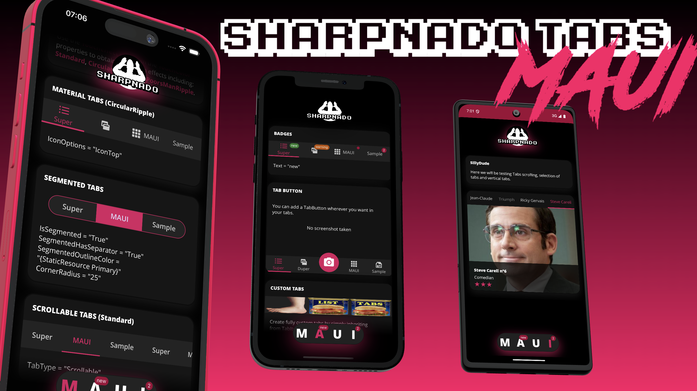
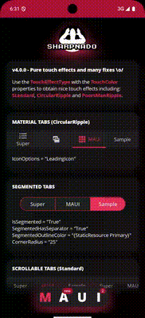

# Sharpnado.Tabs for .NET MAUI

<table>
  <thead>
    <tr>
      <th>MAUI sample</th>
    </tr>
  </thead>
  <tbody>
    <tr>
      <td></td>
    </tr>
  </tbody>
</table>

Get it from NuGet:

[](https://www.nuget.org/packages/Sharpnado.Tabs.Maui)

| Supported MAUI platforms   | 
|----------------------------|
| :heavy_check_mark: Android |
| :heavy_check_mark: iOS     |
| :heavy_check_mark: Windows            |
| :heavy_check_mark: Mac             |

* MAUI version
* Fully customizable
* Underlined tabs, bottom tabs, Segmented control, scrollable tabs
* Pure MAUI touch effects (ripple, standard touch effect) for ALL platforms
* Vertical tabs
* Lazy and Delayed views
* Material tabs specs full implementation
* SVG support thanks to GeometryIcon
* Badge on tabs
* Component oriented architecture
* Layout your tabs and ViewSwitcher as you want
* Bindable

## Platform Demonstrations

<table>
  <thead>
    <tr>
      <th>iOS</th>
      <th>Android</th>
      <th>Windows</th>
      <th>MacCatalyst</th>
    </tr>
  </thead>
  <tbody>
    <tr>
      <td></td>
      <td></td>
      <td></td>
      <td></td>
    </tr>
  </tbody>
</table>

## What's New in Version 4.0

### Pure MAUI Touch Effects

Version 4.0 introduces new touch effect properties that work across all platforms without custom handlers:

* **TouchEffectType**: Choose from `CircularRipple`, `Standard`, or `PoorsManRipple`
* **TouchColor**: Set the color of the touch effect

#### Examples:

**CircularRipple Effect:**
```xml
<tabs:TabHostView TouchColor="{StaticResource Primary}" 
                  TouchEffectType="CircularRipple">
    <tabs:MaterialUnderlinedTabItem Label="Tab 1" />
    <tabs:MaterialUnderlinedTabItem Label="Tab 2" />
</tabs:TabHostView>
```

**Standard Touch Effect:**
```xml
<tabs:TabHostView TouchColor="{StaticResource Secondary}" 
                  TouchEffectType="Standard">
    <tabs:MaterialUnderlinedTabItem Label="Tab 1" />
    <tabs:MaterialUnderlinedTabItem Label="Tab 2" />
</tabs:TabHostView>
```

**PoorsManRipple Effect:**
```xml
<tabs:TabHostView TouchColor="BlueViolet" 
                  TouchEffectType="PoorsManRipple">
    <tabs:MaterialUnderlinedTabItem Label="Tab 1" />
    <tabs:MaterialUnderlinedTabItem Label="Tab 2" />
</tabs:TabHostView>
```

**Live Examples:** See these effects in action in the sample project:
- [TabM.xaml](MauiSample/Presentation/Views/TabM.xaml) - CircularRipple and Standard effects
- [TabA.xaml](MauiSample/Presentation/Views/TabA.xaml) - Standard and PoorsManRipple effects  
- [TabU.xaml](MauiSample/Presentation/Views/TabU.xaml) - CircularRipple effect with SelectedIconSource

### Other Improvements

* **Enhanced platform support**: Full MacCatalyst and Windows support  
* **Improved performance**: Better SelectedItem handling and scroll-to-selected functionality
* **Touch gesture updates**: Modern MAUI gesture handling for better stability
* **SelectedIconSource**: Display different icons for selected/unselected states


## Installation

### MAUI Setup

In your `MauiProgram.cs`, add the Sharpnado.Tabs initialization:

```csharp
public static class MauiProgram
{
    public static MauiApp CreateMauiApp()
    {
        var builder = MauiApp.CreateBuilder();
        builder
            .UseMauiApp<App>()
            .UseSharpnadoTabs(loggerEnable: false);

        return builder.Build();
    }
}
```


## Features Showcase

<table>
  <thead>
    <tr>
      <th>Bottom bar tabs</th>
      <th>Fixed tabs</th>
      <th>Scrollable tabs</th>
    </tr>
  </thead>
  <tbody>
    <tr>
      <td></td>
      <td></td>
      <td></td>
    </tr>
    <tr>
      <td>BottomTabItem</td>
      <td>UnderlinedTabItem</td>
      <td>TabType.Scrollable</td>
    </tr>   
  </tbody>
</table>

<table>
  <thead>
    <tr>      
      <th>Segmented tabs</th>
      <th>Custom tabs</th>
    </tr>
  </thead>
  <tbody>
    <tr>
      <td></td>
      <td></td>
    </tr>
    <tr>
      <td>Neumorphic design</td>
      <td>inherit from TabItem</td>
    </tr>   
  </tbody>
</table>

<table>
  <thead>
    <tr>      
      <th>Material top icon</th>
      <th>Material leading icon</th>
    </tr>
  </thead>
  <tbody>
    <tr>
      <td></td>
      <td></td>
    </tr>
    <tr>
      <td>IconOptions="TopIcon"</td>
      <td>IconOptions="LeadingIcon"</td>
    </tr>   
  </tbody>
</table>

<table>
  <thead>
    <tr>      
      <th>BadgeView</th>
      <th>BadgeView (Chips)</th>
    </tr>
  </thead>
  <tbody>
    <tr>
      <td></td>
      <td></td>
    </tr>
    <tr>
      <td>Numbers, Indicator</td>
      <td>Chips with text</td>
    </tr>   
  </tbody>
</table>

<table>
  <thead>
    <tr>      
      <th>Vertical Tabs</th>
    </tr>
  </thead>
  <tbody>
    <tr>
      <td></td>
    </tr>
    <tr>
      <td>Orientation="Vertical"</td>
    </tr>
  </tbody>
</table>

## Getting Started

### Basic Usage

The core concept is to separate your tabs (`TabHostView`) from your content (`ViewSwitcher`). They communicate through the `SelectedIndex` property:

```xml
<tabs:TabHostView SelectedIndex="{Binding SelectedViewModelIndex, Mode=TwoWay}">
    <tabs:UnderlinedTabItem Label="Tab 1" />
    <tabs:UnderlinedTabItem Label="Tab 2" />
    <tabs:UnderlinedTabItem Label="Tab 3" />
</tabs:TabHostView>

<tabs:ViewSwitcher SelectedIndex="{Binding SelectedViewModelIndex, Mode=TwoWay}">
    <views:View1 />
    <views:View2 />
    <views:View3 />
</tabs:ViewSwitcher>
```

## Features

### Material tabs

Contributor: @mkanyo (Miklos Kanyo)

Since version 2.2, a new type of tab has been introduced: the `MaterialUnderlinedTabItem`.
It's a full implementation of the material tabs specifications:

https://material.io/components/tabs


`IconOptions` values:

1. TopIcon
2. IconOnly
3. LeadingIcon
4. TextOnly

You can also set precisely the gap between the icon and the text thanks to the `IconTextSpacing`.

Instead of using a classic `Image` you can also set a svg `Geometry` (SVG image) icon thanks to the `GeometryIcon` property.

**Cool Hack**: you can use `MaterialUnderlinedTabItem` (and then use a SVG image) as a bottom bar item, just specify `UnderlineHeight = 0`.

If you chose to go down this road you can also set the following properties:

* `public bool Fill`
* `public double StrokeThickness`
* `public double IconTextSpacing`

```xml
<tabs:TabHostView x:Name="TabHost"
                  Grid.Row="4"
                  Style="{DynamicResource DynamicBottomShadow}"
                  Margin="-16,0"
                  BackgroundColor="{DynamicResource Elevation4dpColor}"
                  ShowScrollbar="False"
                  TabType="Scrollable"
                  SelectedIndex="{Binding Source={x:Reference Switcher}, Path=SelectedIndex, Mode=TwoWay}">
    <tabs:TabHostView.Tabs>
        <tabs:MaterialUnderlinedTabItem Style="{StaticResource ScrollableTabStyle}"
                                        IconImageSource="list_96.png"
                                        IconOptions="TopIcon"
                                        IconSize="24"
                                        IconTextSpacing="0"
                                        Label="{localization:Translate Tabs_Quote}"
                                        UnderlineHeight="2" />
        <tabs:MaterialUnderlinedTabItem Style="{StaticResource ScrollableTabStyle}"
                                        IconImageSource="theme_96.png"
                                        IconOptions="IconOnly"
                                        IconSize="24"
                                        IconTextSpacing="0"
                                        Label="FILMO" />
        <tabs:MaterialUnderlinedTabItem Style="{StaticResource ScrollableTabStyle}"
                                        IconImageSource="grid_view_96.png"
                                        IconOptions="LeadingIcon"
                                        IconSize="24"
                                        IconTextSpacing="0"
                                        Label="{localization:Translate Tabs_Meme}" />
        <tabs:MaterialUnderlinedTabItem Style="{StaticResource ScrollableTabStyle}"
                                        Padding="10,0"
                                        IconImageSource="house_96.png"
                                        IconOptions="TextOnly"
                                        IconSize="24"
                                        IconTextSpacing="0"
                                        Label="NONSENSE" />
      </tabs:TabHostView.Tabs>
</tabs:TabHostView> 
```

### UnderlinedTabItem

Let's consider this view:

<p align="center">
  
</p>

And let's have a look at its code:

```xml
<Grid Padding="{StaticResource StandardThickness}"
      ColumnSpacing="0"
      RowSpacing="0">
    <Grid.RowDefinitions>
        <RowDefinition Height="200" />
        <RowDefinition Height="40" />
        <RowDefinition Height="30" />
        <RowDefinition Height="30" />
        <RowDefinition Height="50" />
        <RowDefinition Height="Auto" />
    </Grid.RowDefinitions>

    <!-- first 4 rows then... -->

    <tabs:TabHostView x:Name="TabHost"
                      Grid.Row="4"
                      Margin="-16,0"
                      BackgroundColor="#272727"
                      SelectedIndex="{Binding SelectedViewModelIndex, Mode=TwoWay}">
        <tabs:TabHostView.Tabs>
            <tabs:UnderlinedTabItem Style="{StaticResource TabStyle}" Label="{loc:Translate Tabs_Quote}" />
            <tabs:UnderlinedTabItem Style="{StaticResource TabStyle}" Label="{loc:Translate Tabs_Filmography}" />
            <tabs:UnderlinedTabItem Style="{StaticResource TabStyle}" Label="{loc:Translate Tabs_Meme}" />
        </tabs:TabHostView.Tabs>
    </tabs:TabHostView>

    <ScrollView Grid.Row="5">
        <tabs:ViewSwitcher x:Name="Switcher"
                           Animate="True"
                           SelectedIndex="{Binding SelectedViewModelIndex, Mode=TwoWay}">
            <details:Quote Animate="True" BindingContext="{Binding Quote}" />
            <details:Filmo Animate="True" BindingContext="{Binding Filmo}" />
            <details:Meme Animate="True" BindingContext="{Binding Meme}" />
        </tabs:ViewSwitcher>
    </ScrollView>
</Grid>
```

The ```TabHostView``` and the ```ViewSwitcher``` are really two independent components, and you can place them anywhere. They don't need to be next to each other (even if it would be weird I must admit).

Since they don't know each other, you just need to link them through their ```SelectedIndex``` property. You will bind the ```ViewSwitcher``` to your view model, and the ```TabHostView``` to the ```ViewSwitcher```'s ```SelectedIndex``` property.

You can also see a mysterious ```Animate``` property. It just adds a nice appearing effect. It's really just a little bonus.

#### View Model

```csharp
    public TaskLoaderNotifier<SillyDudeVmo> SillyDudeLoader { get; }

    public QuoteVmo Quote { get; private set; }

    public FilmoVmo Filmo { get; private set; }

    public MemeVmo Meme { get; private set; }

    public int SelectedViewModelIndex
    {
        get => _selectedViewModelIndex;
        set => SetAndRaise(ref _selectedViewModelIndex, value);
    }

    public override void Load(object parameter)
    {
        SillyDudeLoader.Load(() => LoadSillyDude((int)parameter));
    }

    private async Task<SillyDudeVmo> LoadSillyDude(int id)
    {
        var dude = await _dudeService.GetSilly(id);

        Quote = new QuoteVmo(
            dude.SourceUrl,
            dude.Description,
            new TapCommand(url => Device.OpenUri(new Uri((string)url))));
        Filmo = new FilmoVmo(dude.FilmoMarkdown);
        Meme = new MemeVmo(dude.MemeUrl);
        RaisePropertyChanged(nameof(Quote));
        RaisePropertyChanged(nameof(Filmo));
        RaisePropertyChanged(nameof(Meme));

        return new SillyDudeVmo(dude, null);
    }
```

Well I won't go into details it's pretty obvious.
If you want to know more about the mystery ```TaskLoaderNotifier```, please read this post (https://www.sharpnado.com/taskloaderview-2-0-lets-burn-isbusy-true/).


#### UnderlineAllTab

`UnderlinedTabItem.UnderlineAllTab=(true|false)`

You can decide whether or not you want the underline to take the whole tab width, or just the text width.

<p align="center">
  
</p>

#### Styling

The tab style is defined in the content page resources, but we could put it the App.xaml since most of the time we will have one type of top tabs (well it's up to your crazy designer really :)

```xml
<ContentPage.Resources>
    <ResourceDictionary>
        <Style x:Key="TabStyle" TargetType="tabs:UnderlinedTabItem">
            <Setter Property="SelectedTabColor" Value="{StaticResource AccentColor}" />
            <Setter Property="FontFamily" Value="{StaticResource FontSemiBold}" />
            <Setter Property="LabelSize" Value="14" />
            <Setter Property="UnselectedLabelColor" Value="White" />
        </Style>
    </ResourceDictionary>
</ContentPage.Resources>
```

### BottomTabItem

And let's have a look at its xaml:

```xml
<Grid ColumnSpacing="0" RowSpacing="0"
      BackgroundColor="#F0F0F3">
    <Grid.RowDefinitions>
        <RowDefinition Height="{StaticResource ToolbarHeight}" />
        <RowDefinition Height="*" />
        <RowDefinition Height="95" />
    </Grid.RowDefinitions>

    <tb:Toolbar Title="Silly App!"
                BackgroundColor="{StaticResource Accent}"
                ForegroundColor="White"/>

    <tabs:ViewSwitcher x:Name="Switcher"
                       Grid.Row="1"
                       Animate="False"
                       SelectedIndex="{Binding SelectedViewModelIndex, Mode=TwoWay}">
        <customViews:LazyView x:TypeArguments="tabsLayout:HomeView" BindingContext="{Binding HomePageViewModel}" />
        <customViews:LazyView x:TypeArguments="tabsLayout:ListView" BindingContext="{Binding ListPageViewModel}" />
        <customViews:LazyView x:TypeArguments="tabsLayout:GridView" BindingContext="{Binding GridPageViewModel}" />
    </tabs:ViewSwitcher>

    <tabs:TabHostView Grid.Row="2"
                      HorizontalOptions="Center"
                      VerticalOptions="Start"
                      HeightRequest="60"
                      WidthRequest="280"
                      TabType="Fixed"
                      IsSegmented="True"
                      CornerRadius="30"
                      Margin="15"
                      BackgroundColor="#F0F0F3"  
                      SelectedIndex="{Binding Source={x:Reference Switcher}, Path=SelectedIndex, Mode=TwoWay}">
        <tabs:TabHostView.Tabs>
            <tabs:BottomTabItem Style="{StaticResource BottomTabStyle}"
                                IconImageSource="house_96"
                                Label="{localization:Translate Tabs_Home}" />
            <tabs:BottomTabItem Style="{StaticResource BottomTabStyle}"
                                IconImageSource="list_96"
                                Label="{localization:Translate Tabs_List}" />
            <tabs:BottomTabItem Style="{StaticResource BottomTabStyle}"
                                IconImageSource="grid_view_96"
                                Label="{localization:Translate Tabs_Grid}" />
        </tabs:TabHostView.Tabs>
    </tabs:TabHostView>

</Grid>
```

*Warning*: the `CornerRadius` property will only be effective if the `IsSegmented` property is true.

<p align="center">
  
</p>

#### IsTextVisible

`BottomTabItem.IsTextVisible=(true|false)`

If you like your bottom bar items without text:

<p align="center">
  
</p>

#### SelectedTabColor and SelectedTabTextColor

You can set a color for the selected tab via `SelectedTabColor`. 
If you want to have a *different* color for the text, you can specify `SelectedTabTextColor`.

#### Styling

```xml
<ContentPage.Resources>
    <ResourceDictionary>
        <Style x:Key="BottomTabStyle" TargetType="tabs:BottomTabItem">
            <Setter Property="SelectedTabColor" Value="{StaticResource Accent}" />
            <Setter Property="UnselectedLabelColor" Value="Gray" />
            <Setter Property="UnselectedIconColor" Value="LightGray" />
            <Setter Property="FontFamily" Value="{StaticResource FontLight}" />
            <Setter Property="LabelSize" Value="14" />
            <Setter Property="IconSize" Value="28" />
            <Setter Property="IsTextVisible" Value="False" />
        </Style>
    </ResourceDictionary>
</ContentPage.Resources>
```

### Scrollable tabs

<p align="center">
  
</p>

A new Property `TabType` was added to the `TabHostView`: 

```csharp
public TabType TabType

public enum TabType
{
    Fixed = 0,
    Scrollable,
}
``` 

### Vertical tabs

Contributor: @nor0x (Joachim Leonfellner)

Since version 2.1, you can change the orientation of the tabs to achieve vertical tabs.
It could be pretty convenient for landscape or tablet layout.

```xml
<sho:TabHostView x:Name="TabHostLogo"
    Grid.Row="3"
    WidthRequest="200"
    HeightRequest="60"
    Margin="15"
    Padding="20,0"
    HorizontalOptions="Center"
    VerticalOptions="Start"
    BackgroundColor="{DynamicResource DynamicBottomBarBackground}"
    CornerRadius="30"
    IsSegmented="True"
    Orientation="Horizontal"
    Shades="{DynamicResource DynamicBottomTabsShadow}"
    TabType="Fixed">
```

You can find in the silly app (https://github.com/roubachof/Xamarin-Forms-Practices/blob/master/SillyCompany.Mobile.Practices/Presentation/Views/TabsLayout/SillyBottomTabsPage.xaml.cs) an example of dynamically adapting tabs orientation while switching from portrait to landscape:


### Segmented control

Since version 1.7 we can mimic iOS segmented control style.

A new tab item has been created: the `SegmentedTabItem`.
Use it with `IsSegmented`, `SegmentedOutlineColor`, and `SegmentedHasSeparator`, and you will have the classic iOS style.

<p align="center">
  
</p>

```xml
<tabs:TabHostView x:Name="TabHost"
                    Grid.Row="4"
                    HeightRequest="40"
                    Margin="20,15,20,0"
                    VerticalOptions="Center"
                    BackgroundColor="#F0F0F3"
                    Shades="{sh:SingleShade Offset='0,8',
                                            BlurRadius=10,
                                            Color={StaticResource Accent}
                                            Opacity=0.2}"
                    CornerRadius="20"
                    IsSegmented="True"
                    SegmentedHasSeparator="True"
                    SegmentedOutlineColor="{StaticResource Accent}"
                    TabType="Fixed"
                    SelectedIndex="{Binding Source={x:Reference Switcher}, Path=SelectedIndex, Mode=TwoWay}">
    <tabs:TabHostView.Tabs>
        <tabs:SegmentedTabItem Style="{StaticResource SegmentedTabStyle}" Label="Quote" />
        <tabs:SegmentedTabItem Style="{StaticResource SegmentedTabStyle}" Label="Movies" />
        <tabs:SegmentedTabItem Style="{StaticResource SegmentedTabStyle}" Label="Meme" />
    </tabs:TabHostView.Tabs>
</tabs:TabHostView>
```

```xml
<Style x:Key="SegmentedTabStyle" TargetType="tabs:SegmentedTabItem">
    <Setter Property="SelectedTabColor" Value="{StaticResource Accent}" />
    <Setter Property="FontFamily" Value="{StaticResource FontSemiBold}" />
    <Setter Property="LabelSize" Value="14" />
    <Setter Property="SelectedLabelColor" Value="#F0F0F3" />
    <Setter Property="UnselectedLabelColor" Value="Gray" />
</Style>
```

#### Properties

<table>
  <tr>
    <td><code>IsSegmented</code></td>
    <td>Enables segmentation thus clipping for the <code>TabHostView</code>.</td>
  </tr>
  <tr>
    <td><code>CornerRadius</code></td>
    <td>Sets the corner radius for the view.<br> Only works if <code>IsSegmented</code> is set to true.</td>
  </tr>
  <tr>
    <td><code>SegmentedOutlineColor</code></td>
    <td>Sets the corner radius for the view.<br> Only works if <code>IsSegmented</code> is set to true.</td>
  </tr>
  <tr>
    <td><code>SegmentedHasSeparator</code></td>
    <td>Sets a separator between each tab item, the color is given by the <code>SegmentedOutlineColor</code> property.</td>
  </tr>
</table>


### TabButton

Sometimes your designer wants to spice-up a bit the bottom bar tabs by adding a button like a take a picture button. The issue is that the semantic differs from the others tabs since you will make an action instead of swaping views.

So I created the `TabButton` for scenarios like this.

<p align="center">
  
</p>

It has a load of properties to fulfill your designer wildest dreams:

```csharp
public string IconImageSource

public ICommand TapCommand

public int CornerRadius

public Color ButtonBackgroundColor

public Thickness ButtonPadding

public double ButtonWidthRequest

public double ButtonHeightRequest

public double ButtonCircleSize
```

For the circle button the issue is that most of the time, you want it to be bigger and to come out a bit of the bar. It needs a little trick to make it works. For example this is the source of the above circle button:

```xml
<tabs:TabHostView x:Name="TabHost"
                    Grid.Row="2"
                    BackgroundColor="#272727"
                    SelectedIndex="{Binding Source={x:Reference Switcher}, Path=SelectedIndex, Mode=TwoWay}"
                    TabType="Fixed">
    <tabs:TabHostView.Tabs>
        <tabs:BottomTabItem Style="{StaticResource BottomTabStyle}"
                            IconImageSource="house_96.png"
                            Label="{localization:Translate Tabs_Home}" />
        <tabs:BottomTabItem Style="{StaticResource BottomTabStyle}"
                            IconImageSource="list_96.png"
                            Label="{localization:Translate Tabs_List}" />

        <!--  Circle button  -->
        <tabs:TabButton ButtonBackgroundColor="Accent"
                        ButtonCircleSize="60"
                        ButtonPadding="15"
                        IconImageSource="theme.png"
                        Scale="1.3"
                        TranslationY="-10" />

        <tabs:BottomTabItem Style="{StaticResource BottomTabStyle}"
                            IconImageSource="grid_view_96.png"
                            Label="{localization:Translate Tabs_Grid}" />
        <tabs:BottomTabItem Style="{StaticResource BottomTabStyle}"
                            IconImageSource="house_96.png"
                            Label="{localization:Translate Tabs_Home}" />
    </tabs:TabHostView.Tabs>
</tabs:TabHostView>
```

So just a bit of translation and scale here.

You can also decide to have a more boring button, why not?

<p align="center">
  
</p>


```xml
<tabs:TabButton Padding="5"
                ButtonBackgroundColor="Accent"
                ButtonPadding="10"
                CornerRadius="5"
                IconImageSource="camera_96.png" />
```

### Performance Optimization with DelayedView

You probably know the `LazyView` by now, the `DelayedView` is an evolution of it enabling full control of your UI building times.

Using a `DelayedView` will reduce application startup time by deferring the UI building of your components by some milliseconds (the value can be configured).

https://user-images.githubusercontent.com/596903/193819937-eecca609-b0c0-4705-92d2-e52a24803f8d.mp4

All you have is wrap your view in a `DelayedView` inside your `ViewSwitcher`, or even anywhere in your app.

```xml
<tabs:ViewSwitcher x:Name="Switcher"
                           Grid.RowSpan="3"
                           Margin="0"
                           Animate="True"
                           SelectedIndex="{Binding SelectedViewModelIndex, Mode=TwoWay}">
    <tabs:DelayedView x:TypeArguments="views:TabM"
                        AccentColor="{StaticResource Primary}"
                        Animate="True"
                        BindingContext="{Binding HomePageViewModel}"
                        UseActivityIndicator="True" />
    <tabs:DelayedView x:TypeArguments="views:TabA"
                        AccentColor="{StaticResource Primary}"
                        Animate="True"
                        UseActivityIndicator="True" />
    <tabs:DelayedView x:TypeArguments="views:TabU"
                        AccentColor="{StaticResource Primary}"
                        Animate="True"
                        UseActivityIndicator="True" />
    <tabs:LazyView x:TypeArguments="views:TabI" Animate="True" />
</tabs:ViewSwitcher>
```

It can totally work outside of the `Tabs` context.


### BadgeView (Chips)

You can add a badge on any `UnderlinedTabItem` and `BottomTabItem`.

By default the `BadgeView` is placed in the top right corner of the `TabItem` by setting `HorizontalOptions=End` and `VerticalOptions=Start`.

#### Badges on BottomTabItem

<p align="center">
  
</p>

*SillyBottomTabsPage.xml from the Silly! app*

```xml
<!--  Example of segmented tab bar (rounded floating tabs)  -->
<tabs:TabHostView Grid.Row="2"
                    WidthRequest="280"
                    HeightRequest="60"
                    Margin="15"
                    HorizontalOptions="Center"
                    VerticalOptions="Start"
                    CornerRadius="30"
                    IsSegmented="True"
                    Shades="{sh:NeumorphismShades}"
                    TabType="Fixed"
                    SelectedIndex="{Binding Source={x:Reference Switcher}, Path=SelectedIndex, Mode=TwoWay}">
    <tabs:TabHostView.Tabs>
        <tabs:BottomTabItem IconImageSource="house_96.png" Label="{localization:Translate Tabs_Home}">
            <tabs:BottomTabItem.Badge>
                <tabs:BadgeView BackgroundColor="White"
                                BorderColor="{StaticResource Accent}"
                                TextColor="{StaticResource Accent}"
                                Text="999+" />
            </tabs:BottomTabItem.Badge>
        </tabs:BottomTabItem>
        <tabs:BottomTabItem IconImageSource="list_96.png" Label="{localization:Translate Tabs_List}">
            <tabs:BottomTabItem.Badge>
                <tabs:BadgeView BackgroundColor="DodgerBlue"
                                BadgePadding="4,2"
                                TextSize="13"
                                Text="{Binding ListPageViewModel.SillyCount}" />
            </tabs:BottomTabItem.Badge>
        </tabs:BottomTabItem>
        <tabs:BottomTabItem IconImageSource="grid_view_96.png" Label="{localization:Translate Tabs_Grid}">
            <tabs:BottomTabItem.Badge>
                <tabs:BadgeView Margin="20,5"
                                BackgroundColor="Red"
                                ShowIndicator="True"
                                TextSize="14"
                                Text="3" />
            </tabs:BottomTabItem.Badge>
        </tabs:BottomTabItem>
    </tabs:TabHostView.Tabs>
</tabs:TabHostView>
```

#### Badges on UnderlinedTabItem

<p align="center">
  
</p>

*SillyDudePage.xml from the Silly! app*

```xml
<tabs:TabHostView x:Name="TabHost"
                    Grid.Row="4"
                    Margin="-16,0,-16,30"
                    BackgroundColor="{DynamicResource DynamicBottomBarBackground}"
                    CornerRadius="20"
                    Shades="{DynamicResource DynamicTabsShadow}"
                    TabType="Fixed"
                    SelectedIndex="{Binding Source={x:Reference Switcher}, Path=SelectedIndex, Mode=TwoWay}">
    <tabs:TabHostView.Tabs>
        <tabs:UnderlinedTabItem Style="{StaticResource SegmentedTabStyle}" Label="Quote">
            <tabs:UnderlinedTabItem.Badge>
                <tabs:BadgeView BackgroundColor="{StaticResource Accent}"
                                BadgePadding="6,2"
                                FontFamily="{StaticResource FontExtraBold}"
                                TextSize="12"
                                Text="9" />
            </tabs:UnderlinedTabItem.Badge>
        </tabs:UnderlinedTabItem>
        <tabs:UnderlinedTabItem Style="{StaticResource SegmentedTabStyle}" Label="Movies">
            <tabs:UnderlinedTabItem.Badge>
                <tabs:BadgeView BackgroundColor="DodgerBlue"
                                BadgePadding="6,1,6,2"
                                Text="new" />
            </tabs:UnderlinedTabItem.Badge>
        </tabs:UnderlinedTabItem>
        <tabs:UnderlinedTabItem Style="{StaticResource SegmentedTabStyle}" Label="Meme">
            <tabs:UnderlinedTabItem.Badge>
                <tabs:BadgeView Margin="20,0"
                                HorizontalOptions="Start"
                                VerticalOptions="Center"
                                BackgroundColor="White"
                                BorderColor="{StaticResource Accent}"
                                TextColor="{StaticResource Accent}"
                                Text="14" />
            </tabs:UnderlinedTabItem.Badge>
        </tabs:UnderlinedTabItem>
    </tabs:TabHostView.Tabs>
    </tabs:TabHostView>
```

#### Properties

<table>
  <tr>
    <td><b>Property</b></td>
    <td><b>Description</b></td>
    <td><b>Default</b></td>    
  </tr>
  <tr>
    <td><code>Text</code></td>
    <td>Sets the text for the badge text.<br>
If it's an integer, the badge will be hidden if the value is 0.</td>
    <td><code>string.Empty</code></td>
  </tr>
  <tr>
    <td><code>TextSize</code></td>
    <td>Sets the text size used for the badge text.</td>
    <td><code>10</code></td>
  </tr>
  <tr>
    <td><code>TextColor</code></td>
    <td>Sets the text color used for the badge text.</td>
    <td><code>Color.White</code></td>
  </tr>
  <tr>
    <td><code>FontFamily</code></td>
    <td>Sets the font family used for the badge text.</td>
    <td><code>null</code></td>
  </tr>
  <tr>
    <td><code>BadgePadding</code></td>
    <td>Precisely adjust inner text margin.</td>
    <td><code>new Thickness(4, 2)</code></td>
  </tr>
  <tr>
    <td><code>ShowIndicator</code></td>
    <td>Shows a small dot instead of the babdge.</td>
    <td><code>false</code></td>
  </tr>
  <tr>
    <td><code>BackgroundColor</code></td>
    <td>Sets the background for the badge.</td>
    <td><code>Color.Red</code></td>
  </tr>
  <tr>
    <td><code>BorderColor</code></td>
    <td>Sets a border color for the badge.</td>
    <td><code>Transparent</code></td>
  </tr>
  <tr>
    <td><code>Margin</code></td>
    <td>Sets a precise margin for the badge.</td>
    <td><code>10</code></td>
  </tr>
  <tr>
    <td><code>HorizontalOptions</code></td>
    <td>Sets the horizontal location of the badge.</td>
    <td><code>LayoutOptions.End</code></td>
  </tr>
  <tr>
    <td><code>VerticalOptions</code></td>
    <td>Sets the vertical location of the badge.</td>
    <td><code>LayoutOptions.Start</code></td>
  </tr>
</table>

### Custom SPAM tabs !

As I said, your designer can go cuckoo and you won't even sweat it.
<br>Just extend the abstract ```TabItem``` and fulfill the wildest dreams of your colleagues.

<p align="center">
  
</p>

```xml
<tabs:TabItem x:Class="SillyCompany.Mobile.Practices.Presentation.CustomViews.SpamTab"
              xmlns="http://xamarin.com/schemas/2014/forms"
              xmlns:x="http://schemas.microsoft.com/winfx/2009/xaml"
              xmlns:tabs="clr-namespace:Sharpnado.Presentation.Forms.CustomViews.Tabs;assembly=Sharpnado.Presentation.Forms"
              x:Name="RootLayout">
    <ContentView.Content>
        <Grid ColumnSpacing="0" RowSpacing="0">
            <Image x:Name="Spam"
                   VerticalOptions="End"
                   Aspect="Fill"
                   Source="{Binding Source={x:Reference RootLayout}, Path=SpamImage}" />
            <Image x:Name="Foot"
                   Aspect="Fill"
                   Source="monty_python_foot" />
        </Grid>
    </ContentView.Content>
</tabs:TabItem>

...

<tabs:TabHostView x:Name="TabHost"
                  Grid.Row="2"
                  BackgroundColor="White"
                  SelectedIndex="{Binding Source={x:Reference Switcher}, Path=SelectedIndex, Mode=TwoWay}">
    <tabs:TabHostView.Tabs>
        <tb:SpamTab SpamImage="spam_classic_home" />
        <tb:SpamTab SpamImage="spam_classic_list" />
        <tb:SpamTab SpamImage="spam_classic_grid" />
    </tabs:TabHostView.Tabs>
...

```

Please don't be shy with ```Xamarin.Forms``` animations, it's so easy to use and so powerful thanks to the amazing C# ```Task``` api.
<br>**USE.**
<br>**THEM.**

```csharp
private void Animate(bool isSelected)
{
    double targetFootOpacity = isSelected ? 1 : 0;
    double targetFootTranslationY = isSelected ? 0 : -_height;
    double targetHeightSpam = isSelected ? 0 : _height;

    NotifyTask.Create(
        async () =>
        {
            Task fadeFootTask = Foot.FadeTo(targetFootOpacity, 500);
            Task translateFootTask = Foot.TranslateTo(0, targetFootTranslationY, 250, Easing.CubicOut);
            Task heightSpamTask = Spam.HeightRequestTo(targetHeightSpam, 250, Easing.CubicOut);

            await Task.WhenAll(fadeFootTask, translateFootTask, heightSpamTask);

            Spam.HeightRequest = targetHeightSpam;
            Foot.TranslationY = targetFootTranslationY;
            Foot.Opacity = targetFootOpacity;
        });
}
```
## Sample Applications

Explore the sample projects in this repository:
- **MauiSample**: Complete demonstration of all features

## Resources

- [NuGet Package](https://www.nuget.org/packages/Sharpnado.Tabs.Maui)
- [Sample Project](https://github.com/roubachof/Sharpnado.Tabs/tree/master/MauiSample)
- [Issues & Support](https://github.com/roubachof/Sharpnado.Tabs/issues)

## Contributing

Contributions are welcome! Please feel free to submit issues, feature requests, and pull requests.

## License

This project is licensed under the MIT License - see the [LICENSE](LICENSE) file for details.
